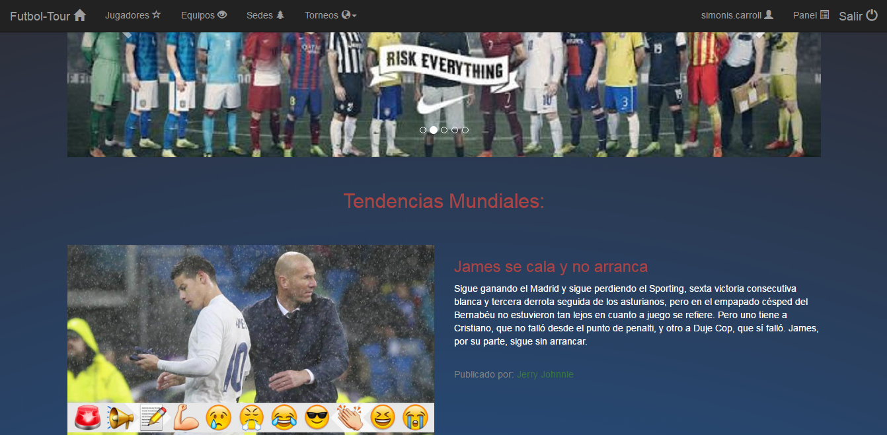
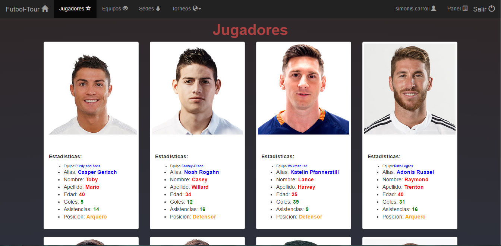
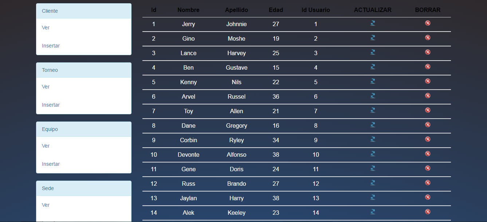

## Sistema de futbol

**Descripcion:**
Trabajo práctico del cuarto cuatrimestre de la Escuela DaVinci construido con *Laravel*, su ORM *eloquent* y un maquetado con boostrap y plantillas *blade*.
La pagina ofrece un sistema *login*, *registro* y un panel en el que el admin puede insertar, modificar y eliminar usuarios.
Trata de una página de futbol que ofrece informacion de *noticias*, *equipos*, *torneos*, *sedes*, *jugadores*.

**Tecnologias usadas: **
Laravel, Eloquent, Blade, Boostrap

Registro:

Inicio:

Jugadores:

Panel:

